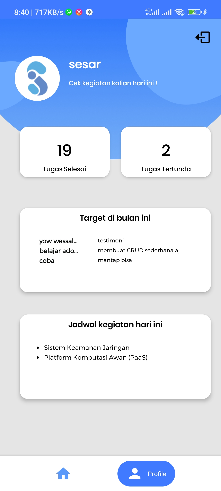
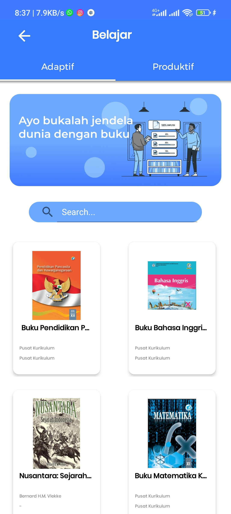
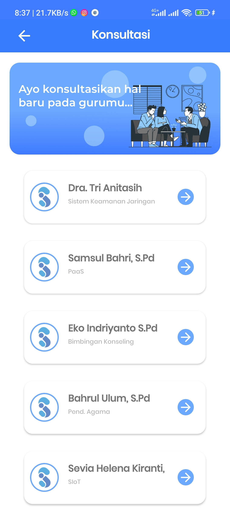
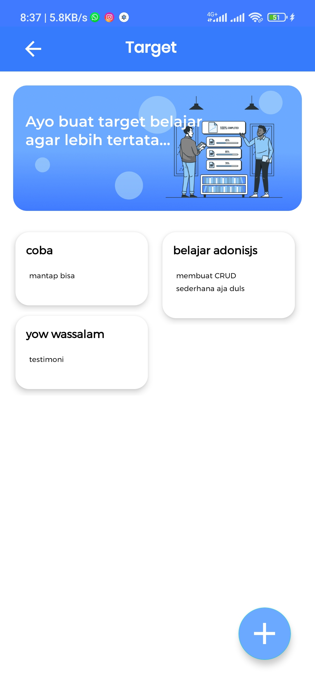
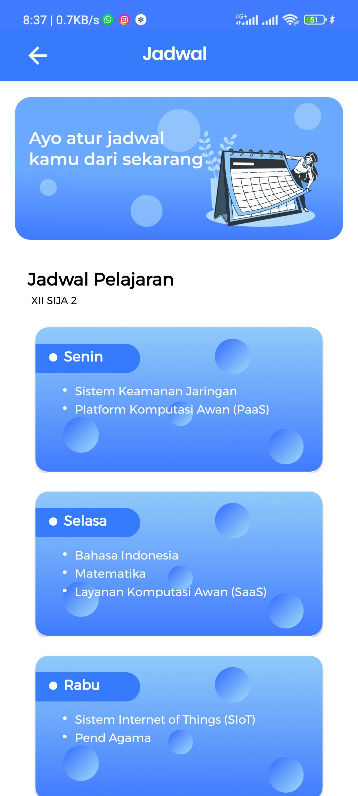
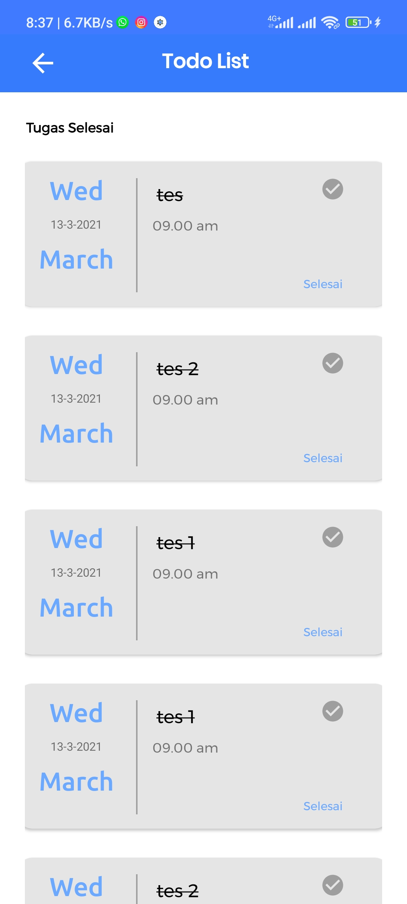
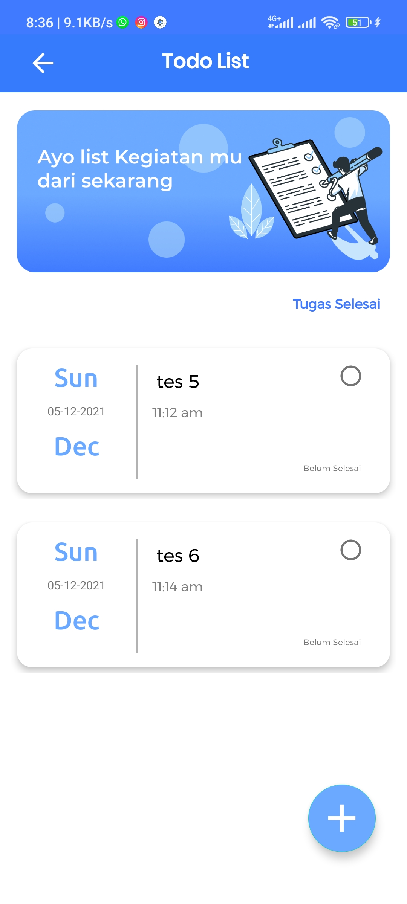
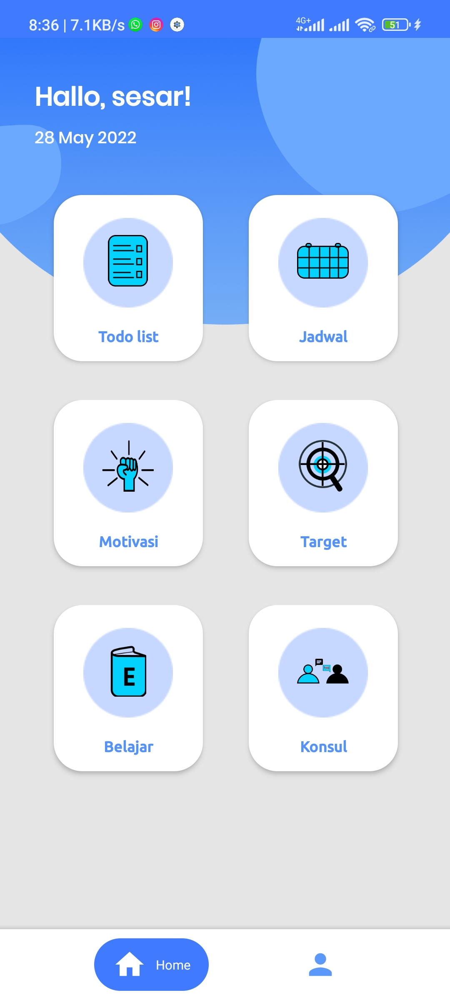
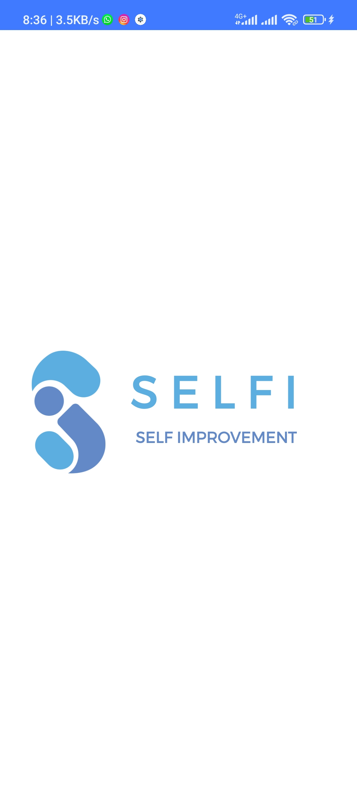

# Selfi

This repository is the result of KAMP Kreatif SMK Indonesia (Smart Apps for School) project with my team and reach 3rd place in the competition.

## Screenshot

    
    
    
     
     
     
     
     
     
     
  

## Tech Stack: 

- Using Retrofit to request api network
- Using Glide for load and caching image from url

## Demo:
https://www.youtube.com/watch?v=RljXecGHeSc

